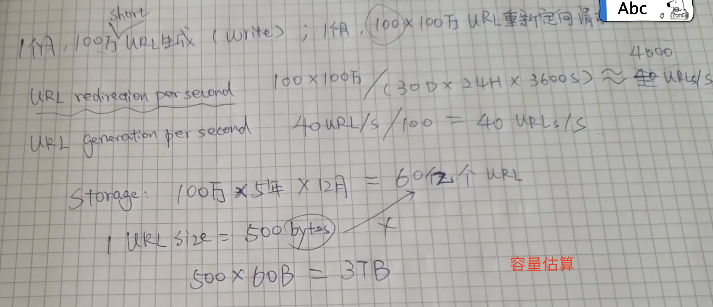
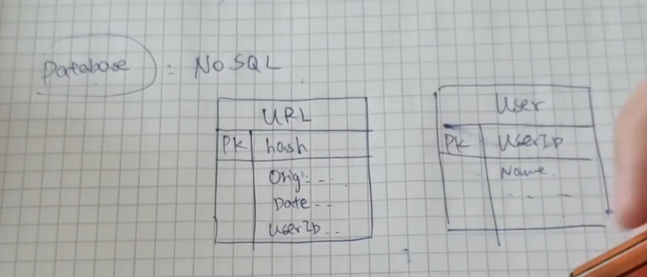
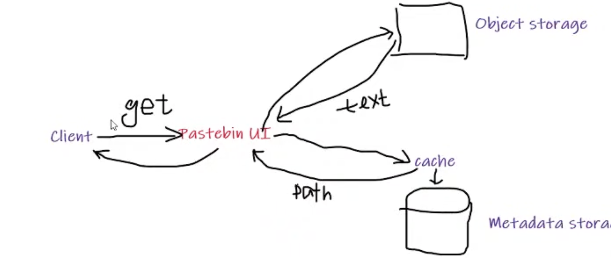
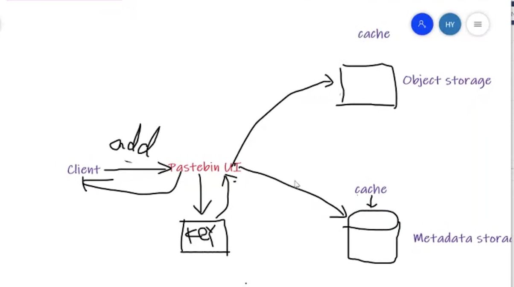
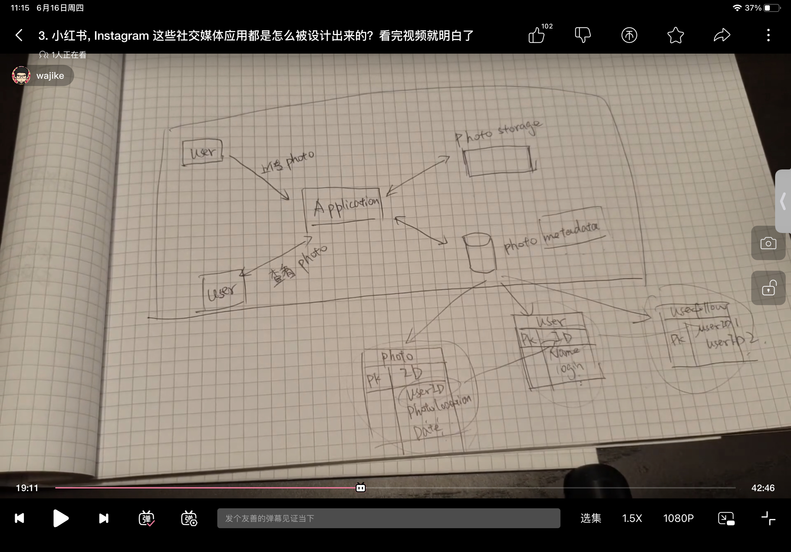
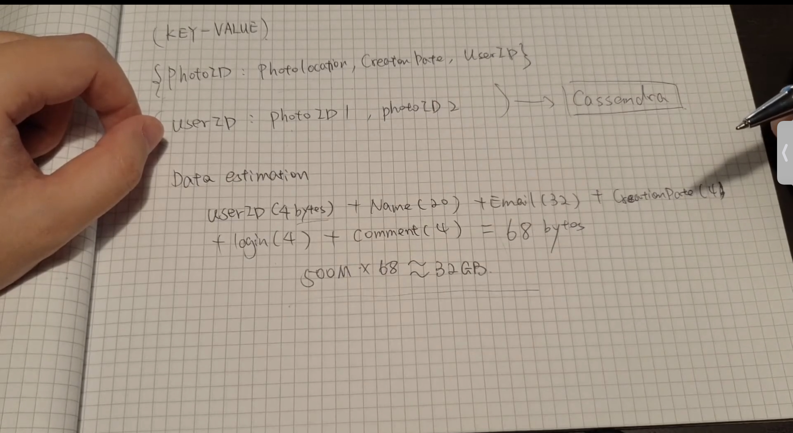
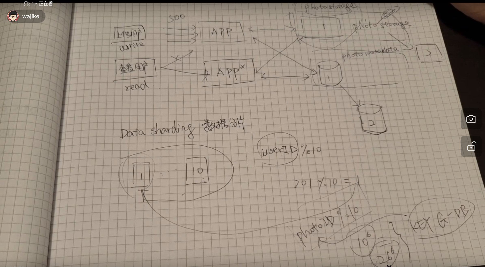
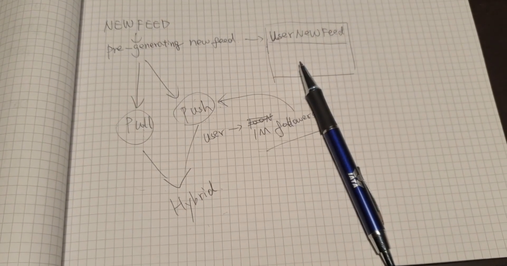
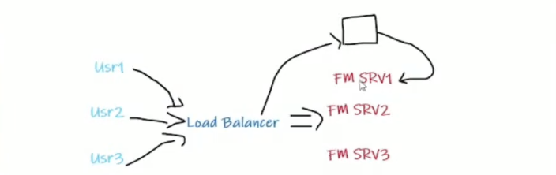
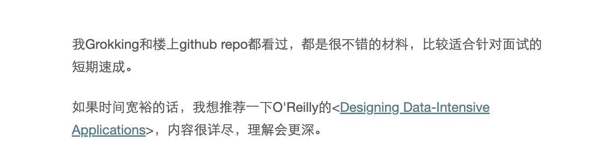

## Shorten URL System

### 基于调研和假设的数据来估算容量 网络带宽，磁盘容量





### API设计

- 生成 (api.key,origin_url,expired_date,user_id) => short_url
- 删除 (api.key,short_url)

### DataBase

NOSQL Scheme




### 自动生成算法

amazon.com => XYZHKL => base64 => 64^6 => 60亿


### 缓存（Cache）


## PasteBin

### 功能性要求（Func）

- user is able to upload(paste)
- Upload text only
- Timespan, expiration time can be specified
- Customized URL

### 非功能性要求(Non-Func)

- High Reliable
- High Available
- Low latency to access the user's paste
- URL is not guessable

### Capacity

- Traffic estimtation

```html
1m 一百万
1.1 write per sec:  new pastes per second: 1m / (24h*3600) = 12 write pastes/s

1.2 read per sec: 10m / (24 * 3600) = 12 read pastes / s

2.2 storage: 1m * 10KB = 10GB/D
一年 51.4TB per year

3.6b * 6(key  one byte per char) = 22GB


```

### Memory

缓存的设计用来加快数据的读取速度

```html
1m write per day
10 read  per day
使用二八原则(20%的产生80%的流量)
cache = 10m * 10KB * 20% = 20GB
```


### API设计

> key根据个人的信息来

- addPaste(key,paste_key,customer_url = None,user_name = None,expiration_time=None)
- getPaste(key,url_key)
- DeletePaste(key,url_key)

### Metadata storage (paste info)

> 使用关系型数据库 SQL
>
> pastes table
>
> users table

###  Object storage （Storage paste text）






Reduncy?


## 社交媒体分享APP

### 功能需求

- 用户上传，下载，关注
- 生成Feed

### 非功能性需求

- HA (High Availalbility)
- Consistency (一致性要求)
- 可靠性 reliability (上传，下载，100%)

### Capacity

```html
500m 用户
1M active user / day
2M new photos / day

one day estimation = 2M * 200KB = 400GB
10年 400GB * 365天 = 1425TB
```

### 系统的设计图

单机存储的情况



分布式存储



数据分片处理



new Feed的两种模式pull 和 push



Cache 二八原则进行划分

### key generation 确保数据的唯一性


## Design Facebook Messager

实时通讯的功能

#### Func Req

- suport one to one chat
- track user status
- storage for the messages  (for messages revovery)

### No-Functional Req

- real time chat with low latency.
- high consistency for  chat history of all devices. (多端设备的消息要具有一致性)
- High availablity for chatting > consistency 

### Capacity Storage

```html
500m users active / day
40 messages / active user
20 b messages / day
day -> 100 bytes
```

### Capacity Bandwidth

```html
2TB / 86400s = 25MB/S
```


### 用户消息获取

根据用户的ID来存储信息


### 用户的状态的获取

增加一个服务器来纪录状态




### 数据


## 总结

- 明确功能性需求和非功能性需求

- 估算磁盘容量，内存容量，网络贷款

- 设计出系统图，考虑可扩展性和可维护性

  > 数据库的选择:SQL (structured query language)和 NoSQL
  >
  > 缓存

  

### 《Designing Data-Intensive Applications》

